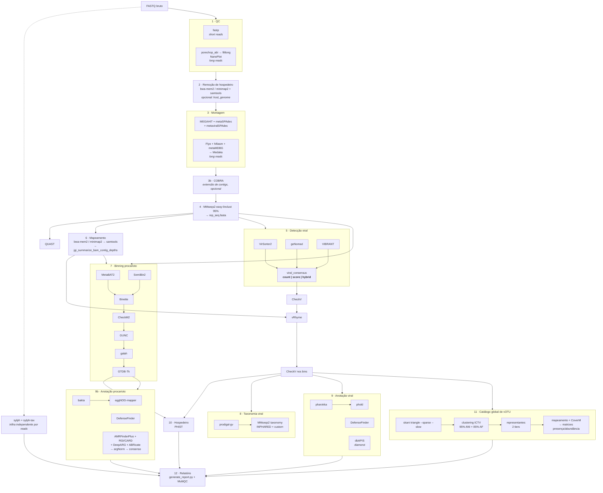

# vapor — mapa de ferramentas por etapa

Levantado direto de `rules/*.smk` (não do README). Estado em 2026-08-17, branch `feat/votu-catalogo-global`.

Três trilhas de execução coexistem: **per-sample** (padrão), **coassembly** (`rules/coassembly.smk`, espelha quase tudo com prefixo `coassembly_`) e **global** (catálogo de vOTU + relatório, roda uma vez sobre todas as amostras).

---

## 1. Visão geral

---

## 2. Inventário por etapa

### 1 · Controle de qualidade — `rules/qc.smk`
| Ferramenta | Uso | Env |
|---|---|---|
| **fastp** | trimming + QC de leitura curta (única ferramenta de QC de SR) | `env_qc` |
| **NanoPlot** | estatísticas de leitura longa | `env_lr_utils` |
| **porechop_abi** | remoção de adaptador ONT | `env_lr_utils` |
| **filtlong** | filtro por comprimento/qualidade em LR | `env_lr_utils` |
| **MultiQC** | agregação (em `report.smk`) | `env_qc` |

> Nota: o `CLAUDE.md` dizia "FastQC, Trim Galore" aqui — corrigido em 2026-08-17. Não existe regra FastQC nem Trim Galore em `rules/`; é tudo fastp.

### 2 · Remoção de hospedeiro — `rules/host_removal.smk`
Opcional, ativa com `host_genome` no config. SR: `bwa-mem2 mem` → `samtools -f 12 -F 256` (mantém pares com ambas as mates não mapeadas). LR: `minimap2 -ax` → `samtools -f 4`. Índice construído por `bwa-mem2 index`.

### 3 · Montagem — `rules/assembly.smk`, `rules/cobra.smk`
| Ferramenta | Trilha |
|---|---|
| **MEGAHIT** | SR (sempre) |
| **metaSPAdes** | SR (`use_spades`) |
| **metaviralSPAdes** | SR, montagem viral dedicada |
| **Flye** | LR |
| **hifiasm** | LR (HiFi) |
| **metaMDBG** | LR (`lr_metaMDBG`) |
| **Medaka** | polimento LR (ONT) |
| **COBRA** | extensão de contigs pós-montagem, por assembler |
| **QUAST** | métricas de montagem |

### 4 · Deduplicação — `rules/merge_dedup.smk`
**MMseqs2** (`easy-linclust`, `MIN_SEQ_ID` = 95%) produz `{sample}_rep_seq.fasta`, o hub central de todo o downstream.

### 5 · Detecção viral — `rules/viral_detection.smk`
| Ferramenta | Score mínimo |
|---|---|
| **VirSorter2** | `--min-score 0.5`, `SCORE_VS2_MIN` |
| **geNomad** | `--min-score 0.7 --enable-score-calibration`, `SCORE_GENOMAD_MIN` |
| **VIBRANT** | — |

Combinação em `viral_consensus` com três modos (`VIRAL_CONSENSUS_MODE`): `count` (≥ `MIN_VIRAL_TOOLS` ferramentas), `score` (qualquer score ≥ limiar) e `hybrid` (count OU uma ferramenta de alta confiança). **Este é o ponto que o benchmark do vOMIX-MEGA questiona** — ver `docs/BENCHMARK_VOMIX_METAFUN.md` §3.4.

### 6 · Mapeamento e cobertura — `rules/mapping.smk`
**bwa-mem2** (SR) / **minimap2** (LR) → **samtools sort/index** → **jgi_summarize_bam_contig_depths**.

### 7 · Binning viral — `rules/viral_binning.smk`
**CheckV** (`end_to_end`, tiers de qualidade) → **vRhyme** (binning) → **CheckV** de novo nos bins → `viral_nonredundant` → `make_votu_table`.

### 8 · Binning procarioto — `rules/prok_binning.smk`
**MetaBAT2** + **SemiBin2** → **Binette** (consolidação) → **CheckM2** (qualidade) → **GUNC** (quimerismo) → **galah** (dereplicação) → **GTDB-Tk** (taxonomia). Contigs virais são removidos antes (`filter_viral_for_prok`).

### 9 · Taxonomia — `rules/taxonomy.smk`
| Ferramenta | Alvo |
|---|---|
| **prodigal-gv** | ORFs virais |
| **MMseqs2 taxonomy** | vs. INPHARED + DBs custom (viral e procarioto) |

Merge final em `viral_taxonomy` → `viral_taxonomy_merged.tsv`.

### 10 · Predição de hospedeiro — `rules/host_prediction.smk`
**PHIST** (k-mers compartilhados vírus×MAG). Única ferramenta desta etapa.

### 11 · Anotação — `rules/annotation.smk`
| Ferramenta | Alvo |
|---|---|
| **pharokka** | fagos HQ (`PHAROKKA_MIN_COMPLETENESS`, default 90%) |
| **phold** | anotação estrutural pós-pharokka |
| **bakta** | MAGs procariotos (filtrado por completeness/contamination) |
| **eggNOG-mapper** | ortologia/KEGG em procariotos |
| — | mapas de genoma (phage / virus / prok) para o relatório |

### 12 · Defesa e AMR — `rules/defense_amr.smk`
| Ferramenta | Alvo |
|---|---|
| **DefenseFinder** | sistemas de defesa em MAGs **e** em ORFs virais (anti-defesa) |
| **dbAPIS** (diamond) | anti-defesa viral |
| **AMRFinderPlus**, **RGI/CARD**, **DeepARG**, **ABRicate** (VFDB+PlasmidFinder) | AMR/virulência |
| **argNorm** | normalização entre as saídas de AMR |
| `amr_consensus` | consolidação |
| — | ilhas de defesa (script próprio) |

### 13 · Catálogo global de vOTU — `rules/votu_catalog.smk`
Pool com IDs prefixados por origem → **skani** `triangle --sparse --slow` (o `--sparse` é obrigatório: a matriz densa não emite aligned fraction, e sem ela o critério ICTV de AF ≥ 85 não é avaliável) → clustering 95% ANI + 85% AF → 2 tiers de representantes (all, mq) → **bwa-mem2/minimap2** + **samtools** + **CoverM** → matrizes vOTU × amostra.

### 14 · Classificação por reads — `rules/reads_classify.smk`
Trilha independente da montagem: **sylph** (profile) → **sylph-tax** → merge → filtro de prevalência → tabela OTU → colapso por hospedeiro. **BACPHLIP** (via `scripts/reads_classify/bacphlip_lifestyle.py`) prediz estilo de vida virulento/temperado, mas **só para genomas de referência detectados pelo sylph** — exige `reads_classify_genome_fasta` no config. Não roda sobre vOTUs montados.

### 15 · Abundância e relatório — `rules/abundance.smk`, `rules/report.smk`
**CoverM** (viral e procarioto), diversidade, `generate_report.py` (HTML standalone com ECharts/D3/Plotly) e **MultiQC**.

---

## 3. Infraestrutura

- **26 envs conda** (era 27 antes da remocao do `env_vcontact3`) em `envs/` (`env_qc`, `env_assembly`, `env_viral`, `env_genomad`, `env_binning`, `env_binette`, `env_checkm2`, `env_gunc`, `env_derep`, `env_gtdbtk`, `env_annotation`, `env_defense`, `env_rgi`, `env_deeparg`, `env_abricate`, `env_argnorm`, `env_vrhyme`, `env_phist`, `env_coverm`, `env_mapping`, `env_cobra`, `env_reads_classify`, `env_flye`, `env_medaka`, `env_lr_utils`, `phage_vibrant`).
- **`container:` por regra** apontando para `CONTAINERS.get(<nome>)`, resolvido a partir de `containers.yaml` / `containers.lock.yaml` — uma imagem **por ferramenta**.
- **Não há** `containerized:` global no `Snakefile` (ver `docs/BENCHMARK_VOMIX_METAFUN.md` §4 — é a mudança de melhor razão esforço/benefício identificada).

### Bibliotecas rápidas já disponíveis mas subutilizadas
| Pacote | Onde está | Onde poderia ser usado |
|---|---|---|
| `pyhmmer=0.12.0` | `env_annotation` | substituir hmmsearch no CheckV (padrão CheckV-PyHMMER) |
| `pyrodigal=3.7.1`, `pyrodigal-gv=0.3.2` | `env_annotation`, `env_genomad` | predição de ORF paralela em vez de `prodigal-gv` serial |
| `pyrodigal-rv=0.1.0` | `env_annotation` | vírus de RNA |

---

## 4. Lacunas identificadas

| Lacuna | Comentário |
|---|---|
| Estilo de vida (lítico/lisogênico) de **vOTUs montados** | BACPHLIP só cobre genomas de referência na trilha de reads; PhaTYP (PhaBOX2) preencheria |
| Índice de hospedeiro curado | `host_removal` usa genoma arbitrário; `hostile` traz índices versionados |
| Microdiversidade / SNV / strain-level | nada equivalente ao inStrain do metaFun |
| Pangenoma / genômica comparativa | sem prokka/panaroo/PPanGGOLiN |
| Perfil de reads que classifique reads individuais | sylph estima abundância taxonômica mas não rotula reads; Kraken2+Bracken cobriria |
| `containerized:` global | instalação em um comando |
